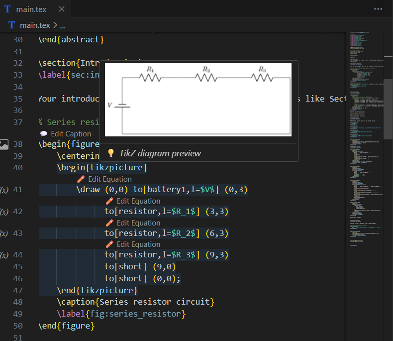
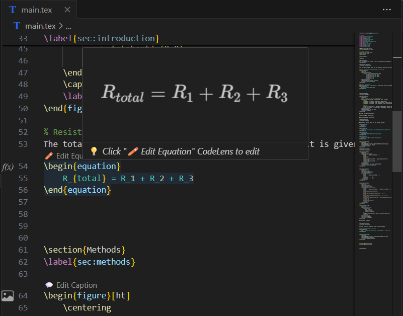
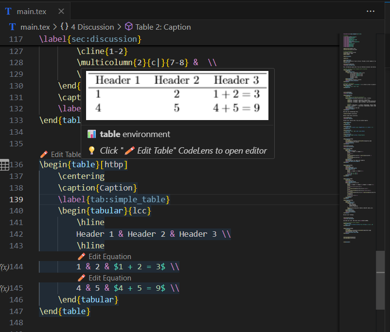
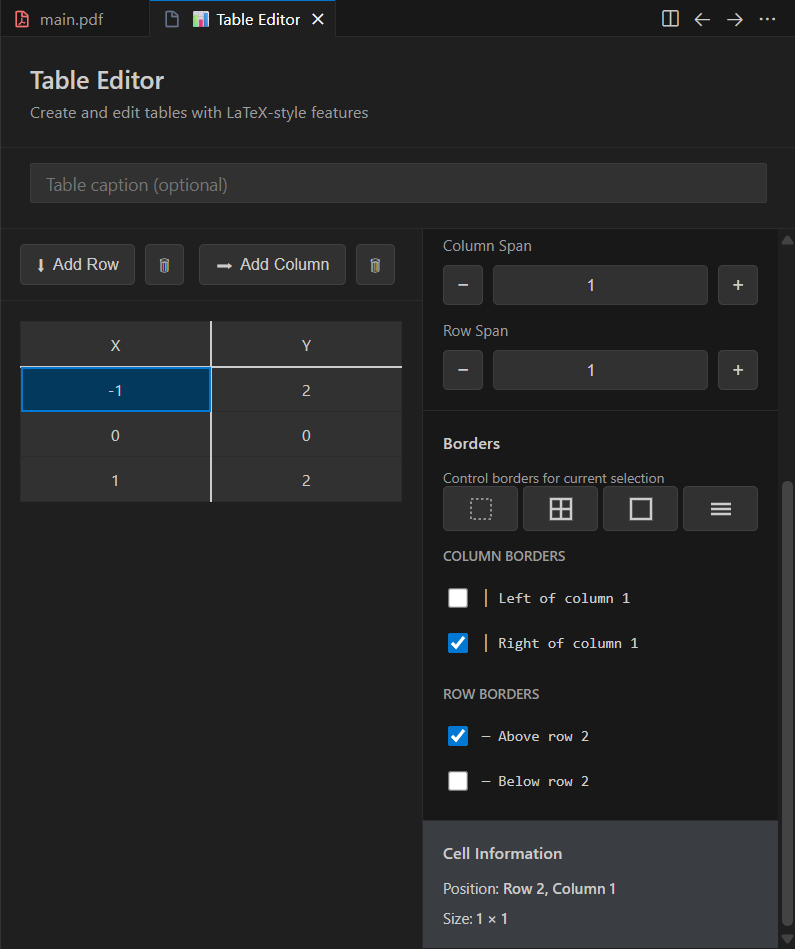
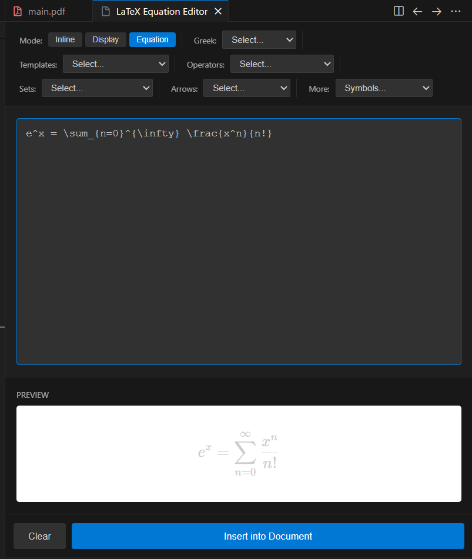
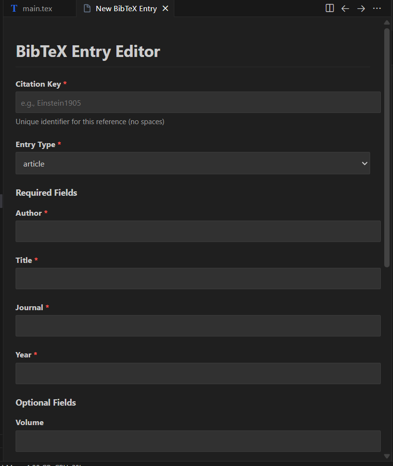
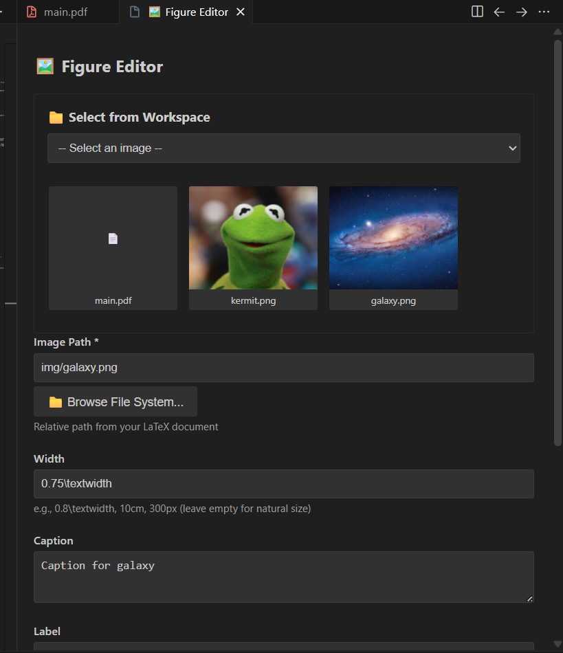

# ∫TeX - Modern LaTeX Editor

**∫TeX** is a modern, local-first LaTeX extension for VS Code, offering fast builds, integrated PDF preview, SyncTeX, and smart tooling powered by texlab LSP server. It combines advanced visual editing tools with a robust hybrid build system.

## Key Features

### 🚀 Hybrid Build System
- **Zero-Config**: Automatically detects your LaTeX distribution.
- **Docker Support**: No local TeX installation? No problem. InTeX can compile your documents using a containerized TeX Live environment.
- **Local Build**: Uses your local `latexmk` or `pdflatex` installation for maximum speed.
- **Caching**: Smart caching for Docker builds ensures fast re-compilation.

### 🖼️ Visual Editors & Previews
- **Table Editor**: Edit LaTeX tables with an Excel-like interface. No more struggling with `&` and `\\`. Live preview as you type.
- **Equation Editor**: Preview and edit complex math equations intuitively.
- **Inline Previews**: See your figures, equations, and tables directly in the editor text.
- **PDF Preview**: Integrated high-performance PDF viewer with **SyncTeX** support. Ctrl+Click to jump between code and PDF.

### ⚡ Productivity Tools
- **IntelliSense**: Powered by `texlab` for robust auto-completion, citation suggestions, and reference management.
- **Bibliography Manager**: specialized BibTeX editor to manage your references easily.
- **Project Templates**: Start new projects quickly with built-in templates for papers, thesis, and presentations.
- **Macro Wizard**: Create and manage reusable LaTeX macros visually.

## Getting Started

1.  **Open a .tex file**: InTeX activates automatically.
2.  **Build**: Press `Ctrl+Alt+B` (or `Cmd+Alt+B` on Mac) to build your project.
3.  **View**: The PDF preview will open automatically on successful build.

## Configuration

InTeX works out of the box, but you can customize it:
- `intex.buildMethod`: Choose `auto`, `local`, or `docker`.
- `intex.pdfViewer`: Select `pdfjs` (recommended) or `native` viewer.
- `intex.latexmk.options`: Customize build arguments.

## Galery

Hover Previews
---

Editors
---

## Contributing

Found a bug or have a feature request? Open an issue on our [GitHub repository](https://github.com/PolarHuskyDev/intex).

## License

MIT
