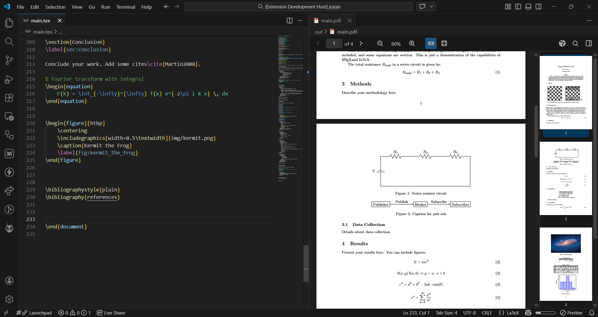

# ∫TeX - Modern LaTeX Editor

**∫TeX** is a modern, local-first LaTeX extension for VS Code, offering fast builds, integrated PDF preview, SyncTeX, and smart tooling powered by texlab LSP server. It combines advanced visual editing tools with a robust hybrid build system.

## Key Features

### 🚀 Hybrid Build System

- **Zero-Config**: Automatically detects your LaTeX environment, either locally installer texlive or docker.
- **Docker Support**: No local TeX installation? No problem. InTeX can compile your documents using a containerized TeX Live environment.
- **Local Build**: Uses your local `latexmk` or `pdflatex` installation for maximum speed.
- **Caching**: Smart caching for Docker builds ensures fast re-compilation.

### 🖼️ Visual Editors & Previews

- **Table Editor**: Edit LaTeX tables with an Excel-like interface. No more struggling with `&` and `\\`. Live preview as you type.
- **Equation Editor**: Preview and edit complex math equations intuitively.
- **Figure Editor**: Browse workspace images, configure sizing and placement, and insert figures visually.
- **PDF Preview**: Integrated high-performance PDF viewer with **SyncTeX** support. Check the command palette for forward search (.tex to PDF) or Ctrl+Click PDF to jump to code.

### ⚡ Productivity Tools

- **IntelliSense**: Powered by `texlab` for robust auto-completion, citation suggestions, and reference management.

## Getting Started

1.  **Open a .tex file**: InTeX activates automatically.
2.  **Build**: Run the Intex: Build command from the command palette or save your .tex file.
3.  **View**: The PDF preview will open automatically on successful build.

## Configuration

InTeX works out of the box, but you can customize it:

- `intex.buildMethod`: Choose `auto`, `local`, or `docker`.
- `intex.docker.image`: Customize the docker image used to build the documents with containers.
- `intex.outputDirectory`: Choose a directory for output files.
- `intex.latexmk.options`: Customize build arguments.
- `intex.lsp.enabled`: Enable or disable LSP (language server protocol) server whenever you want.
- `intex.formatting.latexFormatter`: Formatter for `.tex` files — `tex-fmt` (default), `latexindent`, or `none`.
- `intex.formatting.bibtexFormatter`: Formatter for `.bib` files — `texlab` (default), `tex-fmt`, `latexindent`, or `none`.
- `intex.formatting.lineLength`: Maximum line length used by the formatter (default: `80`, `-1` for no limit).

To enable format-on-save, add to your VS Code settings:
```jsonc
"[latex]": {
  "editor.defaultFormatter": "PolarHuskyDev.intex",
  "editor.formatOnSave": true
}
```
Formatting requires `intex.lsp.enabled` to be `true` and the chosen formatter to be installed and available in `PATH` (e.g. [`tex-fmt`](https://github.com/WGUNDERWOOD/tex-fmt)).

## Gallery

### Integrated PDF viewer with:
- SyncTeX forward and reverse search (Ctrl+Click on PDF to jump to source)
- Text search with match highlighting (Ctrl+F)
- Clickable hyperlinks — internal and external links
- Zoom controls, fit to width, fit to page, and Ctrl+Wheel zoom
- Page navigation via buttons, scroll, page input, and thumbnails
- Keyboard shortcuts for navigation and zoom
- Continuous scroll with lazy rendering for performance
- Toggle thumbnail sidebar for more space 



### Built-in equation editor
- Insert and edit commands in the command palette
- CodeLens "Edit Equation" button on top of every equation
- Live KaTeX preview as you type
- Symbol palette with tabs: Greek, operators, relations, arrows, structures, functions, matrices
- Switch between equation environments (equation, align, \$\$, inline, etc.)
- Label editing for numbered equations
- Real-time sync — changes update your .tex file directly
 


### Table editor
- Excel-like editing with a near-WYSIWYG interface
- Multi-column and multi-row support (merge & split)
- Apply borders to single or multiple cells at once
- Column alignment (left, center, right) visually reflected in the editor
- Caption (top or bottom), labels, and positioning in a single interface
- CodeLens "Edit Table" button for quick access on existing tables
- Real-time sync — changes update your .tex file directly


### Figure editor
- Insert and edit figures from the command palette
- CodeLens "Edit Figure" button on top of every figure
- Browse workspace images in a searchable, scrollable grid with thumbnails
- Click any image to select it — path fills in automatically
- Configure width, height, scale, and rotation angle visually
- Switch between standalone `\includegraphics` and `figure`/`figure*` environments
- Caption (top or bottom), labels, and float positioning in a single interface
- Real-time sync — changes update your .tex file directly


### BibTeX editor
- Full CRUD for `.bib` entries — create, edit, and delete without touching raw BibTeX
- Searchable sidebar: filter entries by citation key, title, or author instantly
- Detail form with dynamic fields — add or remove any BibTeX field on the fly
- Supports all standard entry types (article, book, inproceedings, thesis, etc.)
- Auto-opens beside your `.bib` file (configurable via `intex.bibtexEditor.autoOpen`)
- Manually open through the command palette
- Real-time sync — changes update your `.bib` file directly


## Changelog
- Bug fixes: Table editor had a really hard time opening and parsing complex tables with multi-row and multi-column cells. The new parser is able to handle those better.
- UI improvements to all editors. All editors UI has been reworked and refined for better look and better usability
- PDF Viewer has been greatly enhanced with:
  - Page Thumbnails for navigation
  - SyncTex indicator
  - Continuos scroll allows the user to see the full PDF document just by scrolling
  - Search functionality
- Cleaned up lots of redundant commands from the command palette

## Contributing
Found a bug or have a feature request? Open an issue on our [GitHub repository](https://github.com/PolarHuskyDev/intex).

## License

MIT
